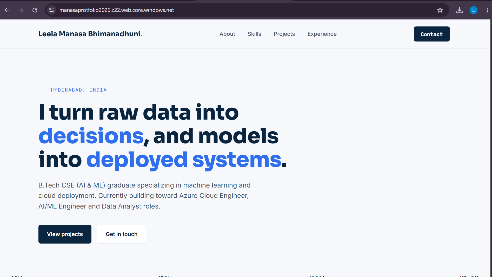
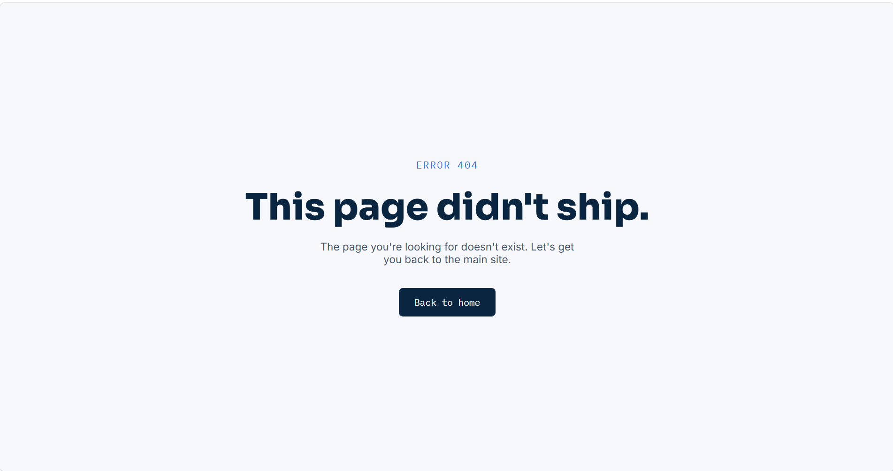

# Portfolio Website — Azure Static Website Hosting

A professional portfolio website showcasing my AI/ML and cloud engineering projects, deployed as a static site using **Azure Blob Storage's static website hosting** feature.

 **Live Demo:** [https://manasaprotfolio2026.z22.web.core.windows.net/](https://manasaprotfolio2026.z22.web.core.windows.net/)

---

##  Overview

This portfolio features a navy/Azure-blue design with an animated **Data → Model → Cloud → Insight** pipeline motif, reflecting my journey from data analysis to machine learning to cloud deployment. It highlights two flagship projects:

- **FIDAC** (Fake Image Detection and Classification) — a DenseNet121-based deepfake detection system
- **Healthcare Data Analysis** — a Random Forest-based diabetes risk prediction model

---

##  Tech Stack

- **Frontend:** HTML, CSS, JavaScript
- **Hosting:** Microsoft Azure — Blob Storage (Static Website Hosting)
- **Storage Account:** StorageV2 (General Purpose v2), Standard performance, LRS redundancy

---

##  Architecture & Deployment

The site is hosted entirely on **Azure Blob Storage** using its built-in static website hosting capability — no VM or App Service required.

**Deployment steps:**

1. Created an Azure Storage Account (StorageV2, Standard, LRS)
2. Enabled **Static Website Hosting** under Data Management
3. Set the index document to `protfolio.html` (custom homepage) and error document to `404.html`
4. Azure automatically provisioned a special `$web` container to host the site files
5. Uploaded the HTML files directly into the `$web` container via the Azure Portal
6. Azure exposed a public **primary endpoint URL** to serve the site over HTTPS

##

Storage Account (StorageV2)\
│\
▼\
Static Website Hosting (enabled)\
│\
▼\
$web container ──> protfolio.html, 404.html\
│\
▼\
Primary Endpoint (public HTTPS URL)

---

##  Screenshots

### Portfolio Homepage

### Custom 404 Page

---

##  Skills Demonstrated

- Azure Storage Account provisioning and configuration
- Static website hosting setup and custom index/error document configuration
- Understanding of Blob Storage container types and `$web` special container behavior
- End-to-end static site deployment without server infrastructure

---

##  Notes

- Resource Group: `protfolio-RG`
- Region: West US
- Redundancy: Locally Redundant Storage (LRS)

---

##  Author

**Bhimanadhuni Leela Manasa**

Azure Cloud Enthusiast
